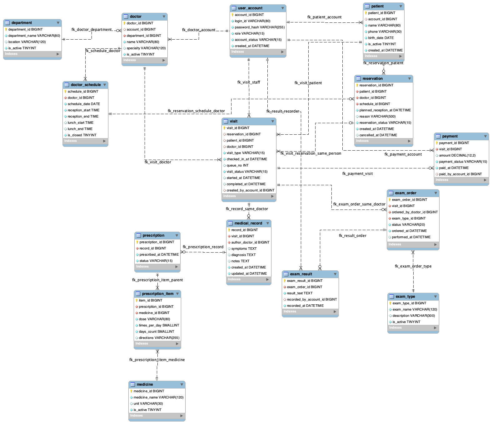

# 병원 예약 및 진료 관리 시스템 — 업무분석 초안

**데이터베이스설계 B반 2팀 | 팀 미팅 자료 | 2026.09.28 기준**  
**팀원:** 김예민 · 김윤재 · 김준모 · 김서희  
**문서 상태:** 회의용 초안. 실제 병원에서 수집하거나 인터뷰로 확인한 업무가 아니라, 팀이 가정한 병원 운영 시나리오를 분석한 내용임.

---

## 현재 결정된 사항과 기존 초안의 차이


| 구분 | 현재 방향 | 상태 |
|---|---|---|
| 프로젝트 | 병원 예약 및 진료 관리 시스템 | 확정 |
| 1차 구현(MVP) | **외래진료**: 환자 → 예약/현장접수 → 대기 → 진료 → 처방·검사 → 간단 결제 | 현재 팀 방향 |
| 현장접수 | 예약하지 않고 방문한 환자도 접수 가능 | 확정 |
| 예약 시간 | **진료 시작 시각이 아니라 접수할 시간**을 예약 | 확정 |
| 진료 순서 | 예약 환자 우선 진료. 예약 환자의 진료가 일찍 끝나면 현장접수 환자를 진료하며, 현장접수 환자의 1시간 대기 기준에 따른 우선순위 변경은 검토 중 | 부분 확정 |
| 예약 불가 시간 | 점심시간, 진료 마감 30분 전부터 새 예약 불가 | 확정 |
| 의사 소속 | 의사 한 명은 하나의 진료과 소속 | 확정 |
| 결제 | 실제 PG·카드 연동 없음. 버튼 클릭으로 결제완료 처리 후 필요한 완료 정보만 DB 저장 | 확정 |
| 수술·입원·병실 | MVP에 포함하지 않고 **교수님 미팅 후 추가 여부 결정** | 보류 |
| 개발환경 | React + Spring Boot + PostgreSQL + MySQL Workbench + GitHub | 확정 |


---

# 01. 프로젝트 개요서

### 1-1. 개요 및 구축 배경

병원을 이용할 때 환자는 진료과와 의사를 확인하고 접수할 시간을 예약하거나, 예약 없이 병원에 방문해 현장에서 접수한다. 병원에서는 환자 정보를 확인하여 접수하고, 대기 중인 환자를 순서에 맞춰 진료한다. 이후 진료 내용에 따라 처방과 검사를 등록하고, 마지막에 결제를 처리한다.

이 과정에서 환자·진료과·의사·일정·예약·접수·진료기록·처방·검사·결제 정보가 연결된다. 예약 정보만 관리하면 현장접수 환자나 실제 진료 순서를 제대로 처리하기 어려우므로, **예약과 실제 접수(진료 방문)를 구분**해서 관리할 필요가 있다. 데이터베이스설계 수업에서 배운 업무분석과 엔터티·관계 설계를 바탕으로 이 연결 구조를 만들고자 한다.

※ 위 내용은 팀 프로젝트를 위한 **가상 병원 업무 시나리오**다. 특정 병원에서 실제로 발생한 오류나 운영 방식을 조사했다고 주장하지 않는다.

### 1-2. 새로운 시스템 소개

하나의 웹 시스템에서 환자용 화면과 병원 측 화면을 나누어 제공한다.

- **환자 화면:** 회원가입, 정보 조회·수정, 진료과·의사 조회, 접수시간 예약, 예약 조회·변경·취소, 본인 진료내역 조회.
- **병원/원무 화면:** 의사 일정 조회·관리, 예약 확인, 예약 환자 접수, 현장접수, 대기 현황 확인, 결제완료 처리 및 내역 확인.
- **의사/의료진 화면:** 담당 환자 확인, 진료상태 변경, 진료기록 작성, 처방·검사 등록, 검사결과 확인/등록(담당자의 정확한 권한은 추가 협의).
- **관리자 화면:** 진료과·의사 정보와 시스템 사용자 관리, 전체 예약·접수 현황 확인.

### 1-3. 구축 범위

| 이번 MVP에 포함 | 교수님과 확인 후 결정 | 현재 제외 또는 단순화 |
|---|---|---|
| 환자·진료과·의사·일정 관리 | 수술 예약 | 실제 PG/카드 결제 연동 |
| 접수시간 예약·조회·변경·취소 | 입원·퇴원 관리 | 실제 의료기관 연동 및 보험 청구 |
| 예약 환자 접수·현장접수·대기 | 병실·병상 배정 | 실제 환자 개인정보 사용 |
| 진료기록·처방·검사·결과 | 예약 알림·대기 신청 등 추가 기능 | 의료영상 판독, 자동 진단 |
| 결제완료 처리, 결제내역 조회, 전자영수증 발급 및 조회 | 상세 청구서·부분결제·환불 | 실제 결제는 제외, 가상으로 전자영수증 발급 및 조회 |

**예상 효과**: 환자와 병원 측에서 예약·접수·진료 진행 과정을 확인하고, 한 번의 진료에서 발생한 처방·검사·결제 정보를 서로 연결해 조회할 수 있다.

### 1-4. 사용자 구분

| 사용자 | 기본 업무 | 조회·수정 범위(초안) |
|---|---|---|
| 환자 | 예약, 변경·취소, 본인 내역 확인 | 본인 정보 및 본인의 예약·진료 내역 |
| 의사 | 본인 일정, 담당 환자 진료, 진료기록·처방·검사 지시 | 담당 업무에 필요한 환자 및 진료 정보 |
| 간호사·원무 직원 | 환자 확인, 예약·현장접수, 대기·상태 관리 | 접수 및 진료 진행에 필요한 정보 |
| 검사 담당자 | 검사 지시 조회, 검사 상태·결과 입력 | 본인에게 허용된 검사 관련 정보 |
| 수납 담당자 | 결제 처리 및 결제완료 확인 | 결제 처리에 필요한 정보 |
| 관리자 | 계정, 진료과, 의사, 일정 등 기준 정보 관리 | 시스템 운영에 필요한 관리 정보 |

병원 직원의 역할을 실제로 몇 종류의 **로그인 권한**으로 구현할지는 회의에서 결정한다. 최초 MVP에서는 원무·검사·수납 역할을 통합할 수도 있다.

---

# 02. 시스템 구성도 — 업무영역과 단위업무

 **기능 구성이며 엔터티 목록과는 다르다.**

```text
병원 예약 및 진료 관리 시스템
├─ 01 환자 관리
│  ├─ 회원가입
│  ├─ 정보 조회/수정
│  └─ 진료내역 조회
│
├─ 02 진료과·의사 관리
│  ├─ 진료과 조회
│  ├─ 의사 조회
│  └─ 의사 일정 관리
│
├─ 03 예약 관리
│  ├─ 예약(접수시간 예약)
│  ├─ 예약 조회
│  ├─ 예약 변경
│  └─ 예약 취소
│
├─ 04 진료 관리
│  ├─ 접수(예약 환자 / 현장접수)
│  ├─ 진료기록
│  └─ 진료상태 관리(대기 포함)
│
├─ 05 처방·검사 관리
│  ├─ 처방 등록
│  ├─ 검사 등록
│  └─ 검사결과 등록
│
└─ 06 결제 관리
   ├─ 결제정보 등록(간단 완료 처리)
   └─ 결제내역 조회
```

### 업무 흐름

**예약 환자:** 진료과 조회 → 의사 선택 → 접수 가능한 일정 조회 → **접수시간 예약** → 병원 방문 → 예약 확인·접수 → 대기 → 진료 → 필요한 처방·검사 → 결제완료 처리.

**현장접수 환자:** 병원 방문 → 환자 확인·등록 → 진료과·의사 확인 → **현장접수** → 대기 → 진료 → 필요한 처방·검사 → 결제완료 처리.

예약 환자를 우선으로 하되, 환자 예약은 30분 단위로 받는다. 하지만 30분 이내에 예약 환자의 진료가 끝날 경우 당일 현장접수도 받는다.

---

# 03. 업무기술서 — 단위업무별 처리 내용

> `[합의]`는 팀의 현재 결정 내용, `[후보]`는 기존 문서에서 가져온 제안, `[질문]`은 팀 또는 교수님 미팅에서 확인할 부분이다. 

## 03-1. 환자 관리 — 회원가입 및 환자정보 관리

- **담당:** 환자(회원가입), 원무 직원(현장 환자 확인 및 등록).
- **처리:** 가입 시 이름·연락처·생년월일 등의 기본정보를 등록한다. 환자가 본인 정보를 조회·수정하고 본인의 진료내역을 확인한다. 현장접수 시 기존 환자가 있는지 검색한 뒤 해당 환자 정보와 연결하거나 새 환자번호를 만든다.
- **업무규칙:** 이름·연락처·생년월일  필수, 본인 정보만 수정, 탈퇴 이후에도 과거 진료기록 보존, 현장 접수는 회원가입 필수.
- **예외:** 입력 정보 누락, 중복 환자 의심, 비회원 현장접수.
- **관련 데이터:** 사용자계정, 환자, 환자번호, 연락처, 생년월일, 계정 상태
- **환자 식별 및 중복 등록 방지 규칙:**
  - 환자 최초 등록 시 고유한 환자번호를 자동 부여한다.
  - 환자번호는 1부터 순차적으로 증가하며 기본키(PK)로 사용한다.
  - 환자 등록 시 이름, 전화번호, 생년월일을 이용하여
    기존 환자정보를 검색한다.
  - 동일한 정보가 발견되면 기존 환자인지 확인한 후
    신규 등록 또는 기존 환자정보 연결을 결정한다.
  - 환자번호는 한 번 발급되면 변경하거나 재사용하지 않는다.


## 03-2. 진료과·의사 관리 — 기본정보 조회 및 소속 관리

- **담당:** 관리자(등록·변경), 환자(조회), 의사(본인 일정 확인).
- **처리:** 진료과별 의사를 연결하고, 해당 의사의 기본정보와 진료 가능 여부를 조회한다.
- **업무규칙 [합의]:** 의사 한 명은 하나의 진료과에 소속된다.
- **업무규칙 [후보]:** 소속 의사가 존재하거나 과거 진료기록에서 사용한 진료과·의사 정보는 임의 삭제하지 않고 비활성화한다.
- **관련 데이터:** 진료과, 의사, 소속 진료과번호, 의사 상태.

## 03-3. 진료과·의사 관리 — 일정 등록 및 변경

- **담당:** 의사 또는 관리자(담당 주체 추가 결정).
- **처리:** 의사별 진료일, 접수 가능 시작·종료 시간, 점심시간, 휴진일을 입력한다. 환자 화면에서는 접수할 수 있는 시간만 표시한다.
- **업무규칙 [합의]:** 점심시간에는 새 예약 불가. 진료 마감 **30분 전부터** 새 예약 불가. 실제 진료 시작시간은 예약 단계에서 확정하지 않는다. 이는 현장접수도 동일.
- **업무규칙 [후보]:** 예약이 있는 일정을 삭제하려면 기존 예약을 먼저 확인하고 처리한다. 지나간 날짜에 대한 새 예약을 금지한다.
- **예외:** 갑작스러운 휴진, 접수 가능 시간의 변경, 이미 예약된 시간이 마감되는 경우.
- **관련 데이터:** 의사일정, 휴진 여부, 접수 가능시간, 예약.

## 03-4. 예약 관리 — 접수시간 예약

- **담당:** 환자(온라인 예약), 병원 직원(필요 시 대리 예약).
- **처리:** 환자가 진료과 → 의사를 선택하고 접수 가능한 날짜·시간을 조회한 다음 예약한다. 시스템은 예약번호, 환자, 담당 의사, 접수 예정일시, 예약상태를 보관한다.
- **업무규칙 [합의]:** 예약시간의 의미는 **진료 시작시간이 아닌 접수 예정시간**이다. 점심시간과 마감 30분 전부터는 예약 불가다.
- **예약 간격 [합의]:** 온라인 예약은 30분 단위로 받는다.
- **예약 정원 [검토 중]:** 동일 의사 및 동일 접수시간에
  예약 가능한 최대 인원은 팀 회의를 통해 결정한다.
- **현장접수 인원 [검토 중]:** 예약 환자의 진료 상황과
  대기시간을 고려한 현장접수 인원 제한 기준을 결정한다.
- **예외:** 시간대 마감, 예약 저장 중 다른 환자가 마지막 자리를 차지한 경우, 휴진으로 인한 예약 불가.
- **관련 데이터:** 환자, 의사일정, 예약, 접수 예정시간, 예약상태.

## 03-5. 예약 관리 — 조회·변경·취소

- **담당:** 환자, 예약 관리 직원.
- **처리:** 예약 목록·상세를 확인한다. 변경 시 새 접수시간을 확인하고 기존 예약 내용을 변경하거나 변경 이력을 남긴다. 취소 시 예약상태를 취소로 바꾼다.
- **업무규칙 [기존 제안서]:** 진료가 시작·완료된 예약은 변경·취소할 수 없다. 취소된 예약으로 접수할 수 없으며, 취소한 자리의 재사용 여부는 시간대 정원 방식에 맞춰 처리한다. 진료사적 전까진 환자가 직접 접수 취소 가능.
- **후보:** 변경 전 예약을 삭제하지 않고 변경 이력을 보관하고, 노쇼·병원 취소·환자 취소를 구별한다.
- **관련 데이터:** 예약, 예약상태, 변경 전·후 일시, 취소 사유 및 일시(이력 저장 여부는 보류).

## 03-6. 진료 관리 — 예약 환자 접수 및 현장접수

- **담당:** 원무·접수 직원.
- **처리:** 예약 환자는 예약번호나 환자정보를 조회해 실제 방문을 확인하고 접수한다. 현장접수 환자는 환자정보와 진료과·의사를 확인한 뒤 **예약 없이도** 접수한다. 접수된 환자에 대해 진료 방문(접수) 정보를 생성하고 대기상태로 연결한다.
- **업무규칙 [합의]:** 현장접수를 허용한다. 따라서 `예약`이 없는 환자에게도 `진료 방문/접수` 데이터가 발생할 수 있어야 한다.
- **후보:** 이미 취소되었거나 진료가 끝난 예약을 재접수하지 않도록 한다. 접수 일시·접수 유형(예약/현장)·담당 직원 정보 보관을 검토한다.
- **예외:** 노쇼 후 늦게 방문한 경우, 동일 환자의 이중 접수, 회원가입하지 않은 현장 환자.
- **관련 데이터:** 환자, 예약(선택 연결), 접수/진료 방문, 접수 일시, 접수 유형.

## 03-7. 진료 관리 — 대기 및 진료상태 변경

- **담당:** 접수 직원·의사.
- **처리:** 접수 완료 환자를 대기목록에서 관리하고, 의사가 다음 환자를 선택하면 진료 중으로 바꾼 뒤 진료를 마치면 완료 처리한다.
- **업무규칙:** 실제 진료 시작시간을 예약에서 고정하지 않고, 예약·접수 순서에 따라 환자를 진료한다. 전 시간대의 현장 접수 환자의 진료 중에 다음 환자의 예약 시간이 될 경우 예약 환자는 대기한다.
- **대기시간 규칙 [검토 중]:**
- 현장접수 환자의 목표 최대 대기시간을 1시간으로 설정한다.
- 1시간 이상 대기하면 직원에게 대기시간 초과 상태를 표시한다.
- 예약 환자보다 우선할지 결정해야함.
- 진행 중인 진료는 중단하지 않으므로 실제 진료시간은
  목표 대기시간을 초과할 수 있다.
- **상태안:** `접수 완료 → 대기 → 진료 중 → 진료 완료`. *예약 상태*(`예약 완료/취소/노쇼`)와 *진료 방문 상태*를 같은 값으로 억지로 합치지 않는 방향을 검토한다.
- **관련 데이터:** 진료 방문, 실제 접수 일시, 대기순서, 진료 시작·완료 일시, 담당 의사.

#### 예시 A. 예약 환자의 진료가 일찍 끝나는 경우

| 시간 | 상황 |
|---|---|
| 16:00 | 예약 환자 A 진료 시작 |
| 16:02 | 현장접수 환자 B 접수 및 대기 |
| 16:15 | 예약 환자 A 진료 완료 |
| 16:15 | 다음 예약시간까지 여유가 있어 B 진료 시작 |
| 16:30 | 다음 예약 환자 C 접수 예정시간 |

- 예약 환자의 진료가 일찍 끝나면 현장접수 환자를 진료한다.
- B의 진료가 16:30을 넘어가더라도 진행 중인 진료를
  중단하지 않는다. 진료 종료 후 C를 우선한다.

#### 예시 B. 예약 환자의 진료가 길어지는 경우

| 시간 | 상황 |
|---|---|
| 16:00 | 예약 환자 A 진료 시작 |
| 16:02 | 현장접수 환자 B 접수 및 대기 |
| 16:30 | 다음 예약 환자 C 도착 및 대기 |
| 16:35 | 예약 환자 A 진료 완료 |
| 16:35 | 현장접수 환자 B보다 예약 환자 C를 우선 진료 |
| 이후 | 예약 환자의 진료 상황에 따라 B 진료 |

- 현장접수 환자가 먼저 대기하고 있더라도
  다음 예약 환자의 접수 예정시간이 되었다면
  예약 환자를 우선 진료한다.

#### 예시 C. 현장접수 환자의 대기시간이 1시간에 도달한 경우

| 시간 | 상황 |
|---|---|
| 16:00 | 예약 환자 A 진료 시작 |
| 16:02 | 현장접수 환자 B 접수 및 대기 |
| 16:30 | 예약 환자 C 도착 및 대기 |
| 16:35 | A 진료 완료 후 C 진료 시작 |
| 17:00 | 다음 예약 환자 D 도착 및 대기 |
| 17:02 | 현장접수 환자 B의 대기시간 1시간 도달 |
| 17:10 | 예약 환자 C 진료 완료 |
| 17:10 이후 | 현장접수 환자 B와 예약 환자 D의 진료순서 결정 필요 |

- 현장접수 환자가 1시간 동안 대기하면
  병원 직원에게 해당 상황을 표시하는 방안을 검토한다.
- 이때 현장접수 환자 B를 먼저 진료할지,
  예약 환자 D를 먼저 진료할지는 아직 확정하지 않았다.
- 진행 중인 진료는 중단하지 않는다.
- 1시간은 대기시간 관리 목표이며,
  실제 진료 시작을 반드시 보장하는 시간은 아니다.
## 03-8. 진료 관리 — 진료기록 작성

- **담당:** 담당 의사.
- **처리:** 환자를 확인하고 증상, 진단 내용, 진료 내용 등을 작성한다. 필요한 처방이나 검사 지시를 해당 진료 방문에 연결한다.
- **업무규칙 [현재 제안서]:** 진료기록은 담당 의사가 작성한다. 기록 수정 시 수정일시 보관을 검토한다.
- **후보:** 하나의 진료 방문에 기본 진료기록 하나를 생성한다. 완료 후 수정 시 수정자·수정일시를 기록한다.
- **관련 데이터:** 진료 방문, 진료기록, 담당 의사, 증상·진단·진료내용, 작성·수정 일시.

## 03-9. 처방·검사 관리 — 처방 등록

- **담당:** 담당 의사.
- **처리:** 해당 진료기록에서 처방을 생성하고 약품을 하나 이상 선택하여 복용정보를 등록한다. 처방전 화면이나 내역 조회에 활용한다.
- **업무규칙 [기존 제안서]:** 유효한 진료 이후 처방 등록 가능. 한 진료에서 여러 약을 처방 가능. 약품별 복용량, 횟수, 기간 저장.
- **후보:** 처방을 잘못 작성한 경우 삭제 대신 취소 상태와 수정 이력을 관리한다.
- **관련 데이터:** 진료 방문·진료기록, 처방, 처방상세, 약품.

## 03-10. 처방·검사 관리 — 검사 등록 및 결과 입력

- **담당:** 의사(검사 지시), 검사 담당자(상태·결과 입력).
- **처리:** 진료에서 필요한 검사를 하나 이상 지정한다. 검사 완료 시 해당 검사 지시에 결과를 등록한다.
- **업무규칙 [기존 제안서]:** 한 진료에 여러 검사 가능, 검사 완료 후 결과 등록, 결과가 연결된 검사 기록은 임의 삭제하지 않음.
- **상태 후보:** 검사 예정 → 진행 중 → 검사 완료. 실제 필요한 단계만 채택한다.
- **관련 데이터:** 진료 방문, 검사 지시, 검사 항목, 검사상태, 검사결과, 결과 등록자/일시.
- **질문:** 검사결과가 나오기 전에 결제·진료완료가 가능하게 할지?

## 03-11. 결제 관리 — 결제완료 처리 및 내역 조회

- **담당:** 병원 수납 직원(또는 통합 병원 관리자).
- **처리:** 해당 진료 방문의 결제 대상 정보를 확인하고 **결제완료 버튼을 누른다**. 완료 처리 후 환자·방문별 결제 내역을 조회한다.
- **업무규칙 후보:** 결제완료 내역에는 환자와 진료 방문, 결제 금액, 완료 일시 등을 연결한다. 중복 완료 처리는 막는다.
이후 전자영수증, 세부내역서를 확인 할 수 있게한다.
- **관련 데이터:** 진료 방문, 결제 금액, 완료 상태, 완료 일시.
- **가상 결제 및 전자영수증 [확정]:**
  - 실제 결제 시스템과 연동하지 않는다.
  - 결제완료 버튼을 누르면 가상 결제내역을 저장한다.
  - 결제완료 정보를 바탕으로 가상 전자영수증을 생성한다.
  - 환자는 본인의 전자영수증을 조회할 수 있다.

## 03-12. 관리자·권한 및 데이터 보존

- **업무규칙 후보:** 환자는 본인 정보만, 의사는 담당 진료 정보만, 직원은 업무에 필요한 정보만 조회·수정한다. 진료·검사·결제와 연결된 과거 기록은 관련 기준 정보가 비활성화되어도 유지한다.
- **개발 시 고려할 점:** 프론트 화면만 숨기는 것으로 끝내지 않고 백엔드에서 접근권한을 확인한다. 실제 환자정보는 사용하지 않고 가상의 테스트 환자 정보만 사용한다. 비밀번호를 저장한다면 평문이 아닌 해시 사용을 검토한다.
- **관련 데이터:** 사용자계정, 역할, 담당 의사/직원, 생성·수정일시.

---

# 04. 사용자 요구사항 분석서

## 4-1. 요구사항 목록 초안

아래는 **실제 병원 직원 인터뷰 결과는 아님 **

| ID | 사용자 | 요구사항 | 상태 |
|---|---|---|---|
| R-01 | 환자 | 회원가입 및 기본정보 조회·수정 | 기본 범위 |
| R-02 | 환자 | 본인 예약·진료내역 조회 | 기본 범위 |
| R-03 | 환자 | 진료과·의사 및 접수 가능 일정 조회 | 기본 범위 |
| R-04 | 환자 | 진료 시작시간이 아닌 **접수 예정시간** 예약 | 팀 결정 |
| R-05 | 환자 | 예약 상세·목록 조회 | 기본 범위 |
| R-06 | 환자 | 예약 변경·취소 | 기본 범위 |
| R-07 | 병원 | 점심시간, 마감 30분 전에는 새 예약 제한 | 팀 결정 |
| R-08 | 병원 | 예약 환자 방문 시 기존 예약을 조회하고 접수 | 팀 결정 |
| R-09 | 병원 | 예약 없는 환자의 현장접수 | 팀 결정 |
| R-10 | 병원/의사 | 접수된 환자를 대기목록으로 관리 | 기본 범위 |
| R-11 | 병원/의사 | 예약 환자 우선 진료 및 현장접수 환자 대기시간 관리 | 기본 우선순위 확정 / 1시간 예외 미정 |
| R-12 | 의사 | 본인 담당 진료의 진료기록 작성 | 기본 범위 |
| R-13 | 의사 | 한 진료에 복수 약품 처방 | 기본 범위 |
| R-14 | 의사/검사 담당자 | 검사 지시 및 검사결과 등록 | 기본 범위 |
| R-15 | 병원 | 결제완료 버튼으로 결제완료 정보 저장 | 팀 결정 |
| R-16 | 관리자 | 의사 한 명을 진료과 하나에만 소속 | 팀 결정 |
| R-17 | 관리자 | 의사 휴진 및 접수 가능 일정 관리 | 기본 범위 |
| R-18 | 공통 | 역할별 본인/담당 데이터 접근 제한 | 기존 문서의 제안 |
| R-19 | 병원 | 시간대별 접수 인원 상한·중복 처리 | **미정** |
| R-20 | 전체 | 수술 예약, 입원·병실 관리 여부 | |
| R-21 | 병원 | 검사 결과 전 진료완료·결제 허용 여부 | **미정** |
| R-22 | 공통 | 예약·진료·검사 상태 변경과 이전 기록 보존 | 기존 문서의 제안 |

## 4-2. 인터뷰/팀 미팅 질문지

교수님 자료에서는 실제 담당자 인터뷰를 통해 현재 업무와 요구사항을 파악한다. 우리 팀은 **현재까지 실제 의료기관 인터뷰 자료가 없는 상태**이므로, 아래는 교수님·팀원과 논의할 질문으로만 작성한다. 인터뷰 답변을 임의로 만들어 넣지 않는다.

| 번호 | 질문 | 미팅 후 기록 |
|---|---|---|
| Q1 | 예약한 시각과 병원에 실제로 도착한 시각 중 진료 대기순서는 어느 것을 기준으로 정할까? | 미정 |
| Q2 | 예약 환자와 현장접수 환자가 함께 대기할 때 순서를 어떻게 합칠까? | 미정 |
| Q3 | 접수시간 하나에 몇 명까지 예약할 수 있나? 일정은 몇 분 간격으로 보여줄까? | 미정 |
| Q4 | 점심시간·마감 30분 전 제한은 온라인 예약만인지 현장접수도 포함인지? | 미정 |
| Q5 | 늦게 도착하거나 오지 않은 예약 환자는 어떻게 처리할까? | 미정 |
| Q6 | 접수된 환자가 진료 전에 취소하려면 누가, 어떤 조건에서 처리할까? | 미정 |
| Q7 | 한 환자가 같은 날 여러 진료과를 이용할 수 있도록 할까? | 미정 |
| Q8 | 현장접수 환자가 앱 회원이 아니어도 환자정보를 만들고 진료할 수 있을까? | 미정 |
| Q9 | 검사를 받아야 할 때 검사·진료·결제 순서를 어떻게 정할까? | 미정 |
| Q10 | 12~15개 수준의 핵심 엔터티를 외래진료만으로 구성해도 괜찮을까? | 교수님 질문 |
| Q11 | 수술 예약을 추가할 필요가 있을까? | 교수님 질문 |
| Q12 | 입원·병실·병상까지 확장해야 할까? | 교수님 질문 |
| Q13 | 결제완료 상태만 기록하는 방식으로 시연해도 괜찮을까? | 교수님 질문 |
| Q14 | 수집할 실제 서류가 없으면 팀에서 만든 모의 양식으로 업무분석을 진행해도 될까? | 교수님 질문 |

---

# 05. 관련문서 목록

교수님 쇼핑몰 사례처럼 **문서명과 관련 업무**를 연결했다. 아래 문서는 우리가 업무를 이해하거나 모의 데이터를 만드는 데 사용할 **문서 후보**다. 아직 실제 병원에서 수집했다고 볼 수 없으며, `미수집/모의 양식 예정`으로 표시한다.

| No. | 관련문서 또는 화면 후보 | 관련 업무 | 확보 상태 |
|---:|---|---|---|
| 1 | 환자 등록 신청서 또는 회원가입 화면 | 환자 등록·정보 수정 | 모의 양식 예정 |
| 2 | 진료과·의사 목록 | 진료과·의사 관리 | 모의 목록 예정 |
| 3 | 의사 진료일정·휴진표 | 일정·접수 가능 시간 | 모의 양식 예정 |
| 4 | 진료 예약 신청/조회 내역 | 예약·변경·취소 | 모의 양식 예정 |
| 5 | 환자 접수대장 및 대기 목록 | 예약·현장접수·대기 | 모의 양식 예정 |
| 6 | 진료기록지 | 진료·진단 | 모의 양식 예정 |
| 7 | 처방전 및 처방상세 | 처방 | 모의 양식 예정 |
| 8 | 검사 지시서 | 검사 등록 | 모의 양식 예정 |
| 9 | 검사 결과지 | 결과 등록 | 모의 양식 예정 |
| 10 | 진료비 결제완료 내역 | 결제완료 관리 | 모의 양식 예정 |
| 11 | 입원 신청서·병실/병상 배정표 | **선택 기능** | 교수님 미팅 후 검토 |
| 12 | 수술 일정표·수술 예약서 | **선택 기능** | 교수님 미팅 후 검토 |

**현재 확보된 프로젝트 자료:** 팀원 작성 Markdown, 김예민이 정리한 제안서 Word, 수업 5~7장 강의자료, 교수님 쇼핑몰 업무분석 사례, 팀 프로젝트 안내문. 이 자료들은 병원 현장의 실무 문서나 실제 담당자 인터뷰 기록을 대신하지 않는다.

---

# 06. 장부·양식 샘플 (모의 양식)

## 샘플 A. 환자 등록/현장접수 확인 양식

| 항목 | 예시 또는 입력란 |
|---|---|
| 환자번호 | 자동 생성 |
| 이름 | [입력] |
| 연락처 | [입력] |
| 생년월일 | [입력] |
| 회원 계정 연결 | 계정 있음 / 없음 |
| 등록일시 | 자동 기록 |
| 등록 방식 | 온라인 가입 / 현장 등록 |

현장등록시 환자가 처음 이용자라면 자동으로 회원가입 되도록 한다.

**데이터 도출:** 환자, 사용자계정(선택), 환자번호, 이름, 연락처, 생년월일, 등록일시

## 샘플 B. 진료 예약 확인 화면

| 항목 | 예시 또는 입력란 |
|---|---|
| 예약번호 | 자동 생성 |
| 환자번호 | 환자 조회 후 선택 |
| 진료과 | [선택] |
| 담당 의사 | [선택] |
| 방문 예정일 | [날짜] |
| **접수 예정시간** | [선택] |
| 예약상태 | 예약 완료 / 변경 / 취소 등 |
| 예약 생성일시 | 자동 기록 |

**데이터 도출:** 환자, 진료과, 의사, 의사일정, 예약.

## 샘플 C. 접수·대기 관리대장

| 접수번호 | 환자번호 | 예약번호 | 접수 유형 | 실제 접수일시 | 담당 의사 | 대기순서 | 상태 |
|---|---|---|---|---|---|---|---|
| V001 | P001 | A001 | 예약 | [일시] | D001 | 미정 | 대기 |
| V002 | P002 | 없음 | 현장 | [일시] | D001 | 미정 | 대기 |

**데이터 도출:** 진료 방문/접수 엔터티. `예약번호`는 현장접수에서 비어 있을 수 있다. **대기순서 산정 방법은 아직 확정 전**이므로 예시에서도 숫자를 임의로 붙이지 않았다.

## 샘플 D. 진료기록·처방·검사 기록지

| 항목 | 예시 또는 입력란 |
|---|---|
| 진료번호 / 접수번호 | 자동 생성 / 방문과 연결 |
| 환자번호 / 담당 의사 | 방문 기록에서 조회 |
| 진료일시 | [일시] |
| 증상·진단·진료 내용 | [의사가 입력] |
| 처방번호 | 처방이 있을 때 생성 |
| 처방상세 | 약품별 복용량·횟수·기간 |
| 검사 지시번호 / 검사 종류 | 검사가 필요할 때 생성 |
| 검사결과 및 등록일시 | 검사 완료 후 입력 |

**데이터 도출:** 진료 방문, 진료기록, 처방, 처방상세, 약품, 검사 지시, 검사결과.

## 샘플 E. 결제완료 내역

| 항목 | 예시 또는 입력란 |
|---|---|
| 결제번호 | 자동 생성 |
| 접수번호 / 진료 방문 | 해당 방문과 연결 |
| 결제금액 | 시연 금액(산정 방식 협의 전) |
| 결제상태 | 미완료 → 결제완료 |
| 결제완료일시 | 버튼 처리 시 기록 |

**개발 범위:** 실제 카드 승인번호·PG 응답코드·실제 은행거래 정보는 저장하지 않는다.

---

# 07. 업무분석 결과에서 도출한 엔터티 후보


## 7-1. 엔터티 후보 / 속성 후보 / 제외·보류 후보

| 구분 | 후보 |
|---|---|
| 주요 엔터티 후보 | 사용자계정, 환자, 진료과, 의사, 의사일정, 예약, 진료방문(접수), 진료기록, 처방, 처방상세, 약품, 검사 지시, 검사결과, 결제 |
| 속성으로 검토할 항목 | 이름, 연락처, 생년월일, 전문분야, 접수 예정시간, 실제 접수일시, 대기순서, 예약상태, 진료상태, 증상, 진단명, 복용횟수, 결과일시, 결제완료일시 |
| 별도 엔터티인지 검토 | 예약 변경 이력, 예약 접수시간대/정원, 사용자 역할, 검사 종류, 청구서·청구 항목 |
| 선택 기능이 정해지기 전에는 보류 | 수술 예약, 입원, 병실/병상, 병상 배정, 퇴원 이력 |

## 7-2. 주요 엔터티 기술서 초안

교수님 수업 예시의 **`엔터티명 / 엔터티 설명 / 관련 속성 / 유사어 / 비고`** 형식을 참고했다.

| 엔터티명 | 엔터티 설명 | 관련 속성 후보 | 비고 |
|---|---|---|---|
| 사용자계정 | 시스템에 로그인할 사용자의 계정 | 계정번호, 로그인 ID, 비밀번호 해시, 역할, 계정상태 | 처음 이용하는 현장 환자는 자동으로 회원가입 |
| 환자 | 진료를 예약하거나 실제로 방문하는 사람 | 환자번호(PK), 이름, 연락처, 생년월일 | 환자번호 자동 발급, 기본정보를 통한 중복 등록 확인 |
| 진료과 | 의사가 소속된 진료 부서 | 진료과번호, 진료과명, 위치, 사용여부 | 의사 1명은 진료과 1개 |
| 의사 | 외래진료를 담당하는 의료진 | 의사번호, 이름, 진료과번호, 전문분야, 상태 | 직원 테이블과 통합할지 검토 |
| 의사일정 | 진료·접수 가능 날짜와 시간 | 일정번호, 의사번호, 날짜, 시작·종료, 점심·휴진 | 접수 정원·시간 간격은 미정 |
| 예약 | 환자가 미리 선택한 접수 예정 정보 | 예약번호, 환자번호, 의사번호, 접수 예정일시, 상태 | **진료 시작시간 아님** |
| 진료방문(접수) | 실제 병원에 도착하여 접수된 방문 내역 | 접수번호, 환자번호, 예약번호(선택), 접수일시, 접수 유형, 대기순서, 상태 | 현장접수 허용의 핵심 |
| 진료기록 | 방문 후 의사가 작성한 기록 | 기록번호, 접수번호, 담당 의사, 증상, 진단, 진료 내용 | 방문 1건당 기본 기록 0~1건 후보 |
| 처방 | 진료를 바탕으로 생성한 처방 | 처방번호, 접수/기록번호, 처방일자, 상태 | 처방상세와 구분 |
| 처방상세 | 처방에 포함된 약품별 정보 | 상세번호, 처방번호, 약품번호, 용량, 횟수, 기간 | 1처방에 여러 약품 |
| 약품 | 처방에서 선택하는 약품 기본정보 | 약품번호, 약품명, 단위 | 참조 테이블 취급 여부 검토 |
| 검사 지시 | 진료에서 의사가 지시한 검사 | 검사 지시번호, 접수번호, 검사종류, 상태, 지시일시 | 검사 종류 마스터 분리 여부 검토 |
| 검사결과 | 검사 지시에 따라 등록된 결과 | 검사 결과번호, 검사 지시번호, 결과 내용, 완료일시 | 결과 발생 전에는 없을 수 있음 |
| 결제 | 특정 진료 방문의 결제완료 내역 | 결제번호, 접수번호, 금액, 결제상태, 완료일시 | 복잡한 청구·PG는 제외 |

위는 **14개 후보**다. 과제 안내문의 `코드·참조 테이블을 제외한 12~15개 또는 필요 시 그 이상` 기준에 맞춰, 약품처럼 참조 성격이 있는 항목과 사용자계정 등을 최종 분류하고 실제 핵심 엔터티 수를 다시 셀 필요가 있다. 수를 맞추려고 불필요한 테이블을 늘리지는 않는다.

## 7-3. 엔터티 간 주요 관계 초안

| 관계 | 현재 모델링 생각 | 근거 업무 |
|---|---|---|
| 진료과 — 의사 | 진료과 1 : N 의사 | 의사는 반드시 한 진료과에 소속 |
| 의사 — 의사일정 | 의사 1 : N 일정 | 의사별 접수 가능 일정 관리 |
| 환자 — 예약 | 환자 1 : N 예약 | 한 환자가 여러 번 예약 가능 |
| 의사 — 예약 | 의사 1 : N 예약 | 예약마다 담당 의사 존재 |
| 환자 — 진료방문 | 환자 1 : N 방문 | 예약·현장접수 둘 다 환자와 연결 |
| 예약 — 진료방문 | 예약 1 : 0..1 방문 **후보** | 현장접수는 예약 없이 방문 생성 |
| 의사 — 진료방문 | 의사 1 : N 방문 | 담당 의사와 접수 환자 연결 |
| 진료방문 — 진료기록 | 방문 1 : 0..1 기본 기록 **후보** | 진료 전에는 기록이 없을 수 있음 |
| 진료기록 — 처방 | 진료기록 1 : 0..N 처방 | 진료기록에 따라 처방 유무·개수 다름 |
| 처방 — 처방상세 | 처방 1 : 1..N 상세 **후보** | 처방에 여러 약품 포함 |
| 약품 — 처방상세 | 약품 1 : 0..N 상세 | 동일 약품 여러 처방에서 사용 |
| 진료방문 — 검사 지시 | 방문 1 : 0..N 검사 지시 | 진료에 따라 검사 유무·개수 다름 |
| 검사 지시 — 검사결과 | 검사 지시 1 : 0..1 최종 결과 **후보** | 검사 완료 전에는 결과 없음 |
| 진료방문 — 결제 | 방문 1 : 0..1 결제 **MVP 후보** | 간단 결제완료만 구현 |

이전 Markdown에는 `staff`, `admission`, `bed`, `bed_assignment`, `invoice`, `invoice_item`을 포함한 **19개 후보**와 여러 번 결제할 수 있는 구조가 있었다. 지금은 **외래진료 MVP·간단 결제 결정에 맞춰** 줄인 상태다. 필요한 경우 기존 Markdown의 확장안을 다시 검토한다.

## 7-4. 7장 강의자료와 연결: 데이터 간 불일치 방지 규칙

7장에서는 **관계가 있는 두 엔터티 중 한쪽이 바뀌거나 삭제될 때 불일치가 생기지 않도록 정하는 규칙**도 강조한다. DB 설계 단계에서 아래를 검토한다.

| 데이터 변화 | 현재 고려하는 처리 기준 | 상태 |
|---|---|---|
| 진료과 삭제 요청, 소속 의사 존재 | 직접 삭제 제한 또는 비활성화 | 후보 |
| 의사일정 변경, 해당 시간 예약 존재 | 예약 영향 먼저 확인; 임의 삭제 제한 | 기존 제안서 내용 |
| 예약 취소, 방문 기록 없음 | 취소 상태 기록. 해당 시간대 정원 복원 방식 결정 | 취소는 합의 / 복원 상세 미정 |
| 이미 취소된 예약으로 접수 시도 | 접수 차단 | 후보 |
| 환자 탈퇴, 과거 진료기록 존재 | 과거 진료기록 보존 | 기존 제안서 내용 |
| 진료기록 없는 처방 생성 | 유효한 진료기록 또는 방문 연결 확인 | 후보 |
| 검사결과가 있는 검사 지시 삭제 | 삭제 제한 또는 상태 관리 | 기존 제안서 내용 |
| 진료방문 없는 결제 생성 | 결제완료 등록 차단 | 후보 |

기본키·외래키·삭제/수정 제한·상태값·트랜잭션 중 무엇으로 구현할지는 **ERD/논리적 설계 단계에서** 결정한다. 현재는 데이터 의미와 규칙을 먼저 합의하는 단계다.

---

# 08. 개발 범위 및 프로젝트 운영 정리 (업무규칙과 구분)

### 사용 예정 기술 목록

- **프론트엔드/UI:** React 기반 웹 화면.
- **백엔드:** Spring Boot 기반 API, 예약·접수·진료 처리.
- **DBMS:** PostgreSQL — 백엔드 담당 팀원들이 전달한 현재 선택.
- **모델링 도구:** MySQL Workbench — 팀에서 편하다고 결정한 도구.
- **협업:** GitHub.

**도구 호환성 확인 메모:** MySQL Workbench는 MySQL용 모델링·관리 도구라 PostgreSQL DB에 직접 연결해 관리하거나 PostgreSQL용 SQL을 그대로 생성하는 도구는 아니다. **팀의 선택을 임의로 바꾸지 않고**, 미팅 때 *Workbench는 초기 ERD 작성에만 사용하고 PostgreSQL DDL·실행·관리는 별도 도구로 할지* 백엔드 담당자와 실제 작업 방식을 확인한다.

### 팀 역할

| 팀원 | 주 담당 | 현재 제안서에 적힌 내용 |
|---|---|---|
| 김윤재 | 프론트엔드 | 환자용 조회·예약 화면 |
| 김예민 | 프론트엔드 | 접수·진료·처방·검사·결제 화면 |
| 김서희 | 백엔드 | 환자·진료과·의사·예약 API 및 DB 연동 |
| 김준모 | 백엔드 | 접수·진료·처방·검사·결제 API 및 DB 연동 |
| 전원 | 공동 | 요구사항/업무분석, 엔터티 도출, ERD 및 DB 설계, 테스트·발표 |

### 대략적인 진행 순서 (팀원 Markdown의 일정안을 현재 범위에 맞게 정리)

| 기간(안) | 진행 내용 | 산출물 |
|---|---|---|
| 9월 | 범위 합의, 제안서 제출, 교수님 미팅 | 제안서, 회의록 |
| 9~10월 초 | 업무분석과 요구사항 확정 | 업무기술서, 요구사항 목록 |
| 10월 | 엔터티 후보·주식별자·관계 정리 | 엔터티 기술서, 초기 ERD |
| 10~11월 초 | 속성·정규화·제약조건 결정 | 논리 ERD, 테이블 정의서 |
| 11월 | PostgreSQL 스키마 구축과 기본 데이터 | SQL 및 시연 데이터 |
| 11~12월 | React·Spring Boot 연동, 기능 검증, 시연 | 프로토타입 및 발표 자료 |

### 기존 팀원 Markdown에 있던 추가 기능·설계 후보

**초안에 있었지만 현재 MVP로 확정하지 않은 내용**도 누락되지 않도록 남긴다.

| 분류 | 기존 Markdown의 항목 | 현재 처리 |
|---|---|---|
| 예약 편의 | 알림, 재예약, 예약 대기 신청·목록 | 선택 후보 |
| 예약 관리 | 변경 이력, 노쇼, 병원 취소, 감사 로그 | 상태·이력 필요성 협의 |
| 진료 확장 | 예약 전 문진표, 보호자 관리, 결과 파일 첨부 | 선택 후보 |
| 비용 관리 | 진료비 자동 산정, 청구서/청구 항목, 부분 결제·환불 | MVP 밖 / 교수님 의견 확인 가능 |
| 병동 업무 | 입원, 병실·병상, 병상 이동 이력, 퇴원 | 교수님 미팅 후 결정 |
| 추가 운영 기능 | 날짜·진료과·의사별 통계 대시보드 | 핵심 기능 완료 후 검토 |
| 개발 구현 세부 | TypeScript/Vite, Spring Security/JWT, JPA, 테스트, Swagger, Docker, Postman | 팀 담당자와 확정 전인 기술 후보. 현재 개발환경으로 단정하지 않음 |
| 범위에서 제외하는 연동 | 실제 SMS·알림톡·PG, 공공 의료 시스템, AI 진단, 원격진료 | 이번 MVP에 없음 |

### 정상 시연 흐름(안)

1. 관리자가 진료과·의사를 등록하고 접수 가능한 일정을 설정한다.
2. 환자 A가 접수시간을 예약한다. 환자 B는 예약 없이 병원을 방문한다.
3. 직원이 A와 B를 각각 **예약 접수 / 현장접수**로 등록한다.
4. 아직 확정되지 않은 대기 우선순위 기준을 적용해 대기 환자를 표시한다.
5. 의사가 진료를 진행하고 진료기록을 입력한다.
6. 필요한 경우 약품을 처방하고 검사를 지시·완료한다.
7. 직원이 결제완료 버튼을 누르고 결제내역을 조회한다.
8. 환자 A가 본인 예약·진료내역을 확인한다.

### 오류·예외 확인 목록(안)

- 점심시간 또는 마감 30분 전에는 새 예약이 차단되는가?
- 휴진 의사의 시간은 접수 가능한 일정으로 보이지 않는가?
- 접수 가능한 시간대 정원을 초과한 요청이 저장되지 않는가? (정원 방식 확정 후)
- 예약하지 않은 환자도 진료 방문 내역을 생성할 수 있는가?
- 동일 예약을 두 번 접수하지 않도록 처리하는가?
- 진료가 이미 시작·완료된 예약을 일반 환자가 임의 변경할 수 없는가?
- 담당자가 아닌 사람이 다른 환자의 진료기록을 무단 조회·수정할 수 없는가?
- 존재하지 않는 방문에 처방·검사·결제를 등록하지 않는가?
- 결제완료 버튼을 반복 클릭해 결제내역이 중복 생성되지 않는가?

# 09. 교수님 미팅용 질문 및 기록란


| 우선 | 질문 | 현재 생각 | 답변/결정 |
|---:|---|---|---|
| 1 | 외래진료만으로 MVP를 잡고 DB 핵심 엔터티 12~15개 수준을 구성해도 될까요? | 외래 우선 | □ |
| 2 | 수술 예약이나 입원·병실 중 어떤 범위까지 추가하는 것이 적절할까요? | 아직 제외 | □ |
| 3 | **접수시간 예약 + 현장접수 + 대기순서** 구조에서 추가로 결정해야 할 업무규칙이 있을까요? | 상세 순서 미정 | □ |
| 4 | 실제 병원 서류가 없다면 팀이 만든 **모의 예약서·접수대장·진료기록지**를 업무분석 자료로 사용해도 될까요? | 모의 양식 준비 | □ |
| 5 | 실제 PG 연동 없이 결제완료 버튼과 DB 저장까지만 구현해도 될까요? | 단순 결제 | □ |
| 6 | 업무분석서 산출물(개요서·구성도·기술서·요구사항·문서목록·양식)을 다음 단계에서 어떤 형식으로 제출하면 될까요? | 이번에는 제안서와 별도 미팅 자료 | □ |
| 7 | 정식 업무분석을 보완할 때 우선 확인해야 할 현장 규칙이나 서류가 있을까요? | 미정 | □ |

**미팅 후 바로 수정할 항목**

- [ ] MVP 범위 최종 확정.
- [ ] 예약 환자와 현장접수 환자의 대기순서 결정.
- [ ] 접수시간 간격, 시간대별 허용 인원, 점심·마감 관련 예외 결정.
- [ ] 실제 인터뷰 또는 추가 수집할 병원 업무자료 여부 결정.
- [ ] 사용자 역할·권한 범위 합의.
- [ ] 12~15개 핵심 엔터티 분류 후 ERD 작성.
- [ ] PostgreSQL과 Workbench를 각각 어느 작업에 사용할지 확인.
- [ ] 기술 스택·개발 일정·담당 업무 최종 업데이트.

---

# 10. erd 초안
